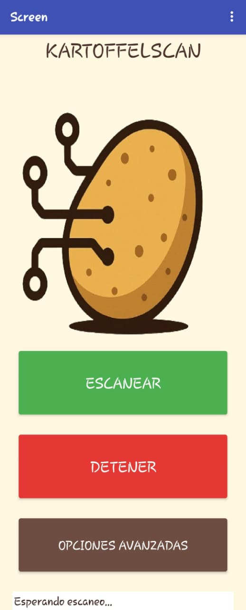

---

## 📊 Diagrama de flujo — Lógica del Módulo de Software

A continuación se presenta el diagrama de flujo general que representa cómo funciona la aplicación móvil desarrollada en MIT App Inventor para controlar el sistema Kartoffelmachine.

(Opciones%20Avanzadas.jpeg)
  

## 🖼️ Evidencias del Desarrollo de la App

A continuación se muestran las pantallas y el código utilizado para crear el módulo de software que controla el sistema Kartoffelmachine.

---

### 📱 Pantalla Principal  
#### `Principal.jpeg`  

Esta es la pantalla principal desde donde el usuario puede:  
- Iniciar el proceso de escaneo automático  
- Detener el escaneo  
- Acceder al menú de opciones avanzadas  

Su diseño es simple y permite operar el dispositivo de forma rápida.

---

### 🧩 Código de la Pantalla Principal  
#### `Principal Codigo.png`  

Aquí se muestra la lógica que:  
- Envía comandos a la ESP32-CAM mediante URLs  
- Recibe respuestas del servidor  
- Gestiona los comandos provenientes de la pantalla Opciones Avanzadas  

Es la parte del programa que coordina todo el flujo principal del sistema.

---

### ⚙️ Pantalla de Opciones Avanzadas  
#### `Opciones Avanzadas.jpeg`  

En esta pantalla el usuario puede controlar:  
- Encendido/apagado del **LED**  
- Encendido/apagado del **MOTOR**  
- Captura de fotografía  
- Regresar a la pantalla principal  

Es útil para el control manual del sistema.

---

### 🧠 Código de Opciones Avanzadas  
#### `Opciones Avanzadas Codigo.png`  

Este bloque contiene la programación que:  
- Envía comandos como `"LED_ON"`, `"LED_OFF"`, `"MOTOR_ON"`, `"CAPTURAR"`, etc.  
- Retorna esos valores a la pantalla principal  
- Permite que cada botón ejecute una acción específica  

Es una parte esencial del control manual dentro de la aplicación.

---
