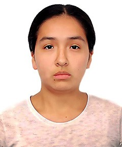
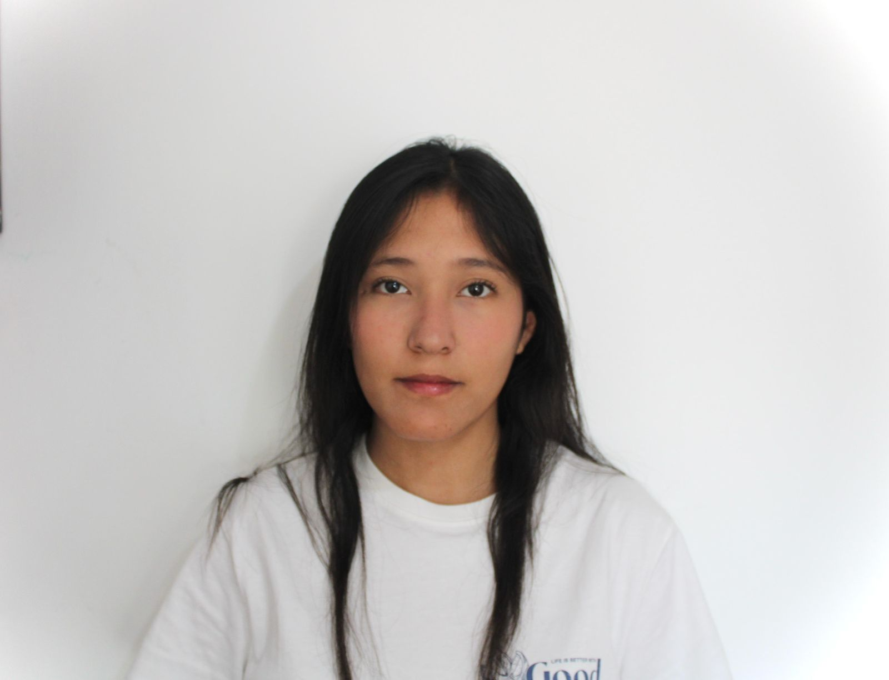

<!-- Encabezado -->
<h1 align="center">Equipo 7 — Fundamentos de Diseño 2025-2</h1>

<b>Kartoffelmachine</b> · Clasificador inteligente de papas

  <em>ODS 12 — Producción y Consumo Responsables</em>

  
  
  
  

  

---

## 🧭 Descripción
El **Equipo 7** desarrolla *Kartoffelmachine*, un clasificador inteligente de papas que combina **ESP32-CAM y machine learning** para identificar tamaño, variedad y calidad (detectando papas verdes o dañadas).  
El objetivo es **reducir pérdidas poscosecha** y apoyar la **ODS 12: Producción y Consumo Responsables**.

ODS relacionadas:  
- ♻️ ODS 12: Producción y Consumo Responsables  
- 🌾 ODS 2: Hambre Cero  
- ❤️ ODS 3: Salud y Bienestar  
- 🌍 ODS 13: Acción por el Clima  

---

## 📑 Contenido
- [ODS 12](#🌍-ods-12)  
- [Problemática en el Perú](#🥔-problemática-en-el-perú)  
- [Propuesta de solución](#💡-kartoffelmachine--clasificador-inteligente-de-papas)  
- [Materiales](#🛠️-materiales)  
- [Metodología](#🧩-metodología)  
- [Temática](#🎯-temática)  
- [Integrantes](#👥-integrantes-del-equipo)  
- [Docentes](#👩‍🏫-docentes)  
- [Resumen](#📝-resumen)  

---

## 🌍 ODS 12
La **ODS 12** busca garantizar patrones de producción y consumo sostenibles, promoviendo el uso eficiente de los recursos y la reducción de pérdidas en toda la cadena alimentaria. En el caso de la papa —un cultivo clave en el Perú— las pérdidas poscosecha por mala clasificación, almacenamiento inadecuado o deterioro del producto representan un problema económico, social y ambiental.

*Kartoffelmachine* se alinea con esta ODS al mejorar la clasificación de papas, optimizar su aprovechamiento y reducir el desperdicio, contribuyendo a una cadena de valor más responsable y sostenible.

### 🎯 Metas de la ODS 12 relacionadas

- **Meta 12.3:**  
  *“De aquí a 2030, reducir a la mitad el desperdicio de alimentos per cápita en la venta al por menor y a nivel de los consumidores, y reducir las pérdidas de alimentos en las cadenas de producción y suministro.”*

- **Meta 12.5:**  
  *“De aquí a 2030, reducir de manera sustancial la generación de desechos mediante actividades de prevención, reducción, reciclado y reutilización.”*

---

## 🥔 Problemática en el Perú
En la costa central, especialmente en zonas productoras como **Conchán**, la cadena poscosecha de papa enfrenta diversas dificultades:

1. **Pérdidas por mala clasificación**  
   La clasificación manual por tamaño y calidad es lenta y subjetiva. Esto provoca:
   - Mezcla de papas verdes o dañadas con papas en buen estado.  
   - Rechazo de lotes completos por defectos visibles.  
   - Menores ingresos para pequeños agricultores.

2. **Deterioro por almacenamiento inadecuado**  
   La exposición a luz y condiciones poco controladas favorece el **enverdecimiento** de la papa, aumentando la solanina (sustancia tóxica). Esto afecta la inocuidad del alimento y genera más desperdicio.

3. **Falta de herramientas accesibles**  
   Muchos sistemas de clasificación industrial son costosos y difíciles de implementar en contextos rurales o de pequeña escala, dejando a los productores sin alternativas tecnológicas adecuadas.

4. **Impacto ambiental y social**  
   El desperdicio de papa implica:
   - Desaprovechar agua, suelo, energía y tiempo invertidos en su producción.  
   - Menor disponibilidad de alimentos (relación con **ODS 2: Hambre Cero**).  
   - Riesgos para la salud si papas verdes llegan al consumo (**ODS 3: Salud y Bienestar**).  

En conjunto, estos factores evidencian la necesidad de **soluciones simples, económicas y sostenibles** que apoyen una mejor clasificación y uso de la producción.

---

## 💡 Kartoffelmachine – Clasificador inteligente de papas

### Propuesta de solución
**Kartoffelmachine** es un prototipo que emplea una **ESP32-CAM** y un modelo de *machine learning* para analizar papas canchan y clasificarlas según su **tamaño** y **calidad**. El sistema busca ser **accesible y replicable** para contextos educativos y productivos de pequeña escala.

#### ¿Cuál será su uso?
- **En la práctica diaria:**  
  - Apoyar la clasificación de papas por tamaño (pequeña, mediana, grande).  
  - Identificar papas verdes o con defectos visibles para separarlas del producto apto para consumo.

- **En el contexto educativo:**  
  - Servir como herramienta de aprendizaje en temas de **ODS, tecnología, IA y sostenibilidad**.  
  - Sensibilizar sobre la reducción de pérdidas de alimentos y el consumo responsable.

#### Objetivo
Diseñar un sistema **económico, modular y didáctico** que mejore la clasificación de papas canchan, reduzca pérdidas poscosecha y promueva prácticas de producción y consumo responsables alineadas con la **ODS 12**.

---

## 🛠️ Materiales
| Material | Cantidad | Función |
|----------|----------|---------|
| ESP32-CAM | 1 | Captura imágenes y ejecuta el modelo ML. |
| USB to Serial Converter | 1 | Programación de la ESP32-CAM. |
| Pantalla OLED 0.96" | 1 | Muestra resultados de clasificación. |
| Bluetooth HC-05 | 1 | Envía resultados a celular/PC. |
| Batería 18650 | 1 | Alimentación recargable del sistema. |
| Aro/tira LED | 1 | Iluminación constante para la cámara. |
| Papas de muestra (Conchán) | 1 kg c/u | Dataset real para entrenamiento ML. |

---

## 🧩 Metodología
1. **Investigación** → análisis de desperdicio poscosecha y necesidades de clasificación de papa en el contexto local.  
2. **Diseño** → propuesta de estructura reciclada e integración de la ESP32-CAM con la interfaz de usuario.  
3. **Programación** → captura de imágenes y ejecución del modelo de *machine learning* para clasificación.  
4. **Pruebas** → experimentación con papas canchan reales para validar clasificación por tamaño y calidad.  
5. **Iteración** → ajustes en el modelo y en el diseño físico para mejorar precisión y usabilidad.  

---

## 🎯 Temática
*Kartoffelmachine* combina **IoT, visión artificial y machine learning** para:  
- ⚖️ Clasificar papas por **tamaño** (pequeña, mediana, grande).  
- 👀 Evaluar la **calidad**, identificando papas verdes o con defectos visibles.  
- ♻️ Contribuir a la **reducción de pérdidas poscosecha** y al **consumo responsable** de alimentos.  

---

## 📸 Fotografía del Equipo

---

## 👥 Integrantes del Equipo  

| Foto                                                                 | Nombre                                | Rol                          | Intereses                                      |
|----------------------------------------------------------------------|---------------------------------------|------------------------------|------------------------------------------------|
|     | **Josue Cristhian Mateo Mogollon Flores** | Líder del equipo            | Innovación social, sostenibilidad              |
|   | **Mathias Dylan Henry Quispe Charres**  | Diseñador                   | Diseño de prototipos, creatividad aplicada     |
|    | **Nicole Jacqueline Anyosa Barrientos** | Responsable de investigación | Gestión ambiental, desarrollo comunitario      |
|     | **Dayra Martina Kuang Mauricio**        | Encargada de documentación  | Comunicación científica, redacción técnica     |

---

## 👩‍🏫 Docentes
- Jhomer Rodrigo Contreras Paucca  
- Julissa Elvira Venancio Huerta  

---

## 📝 Resumen
El prototipo **Kartoffelmachine** usa **cámara y modelos de machine learning** para clasificar papas canchan según su tamaño y calidad, reduciendo pérdidas poscosecha y promoviendo el **consumo responsable** y la **sostenibilidad agrícola**, en línea con la **ODS 12**.
