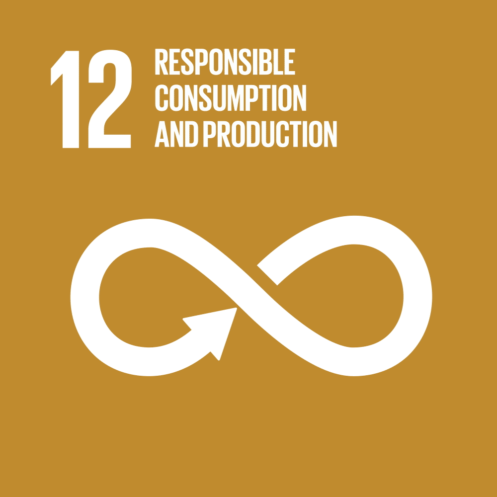
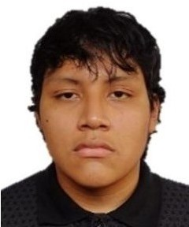

<!-- Encabezado -->
<h1 align="center">Equipo 7 — Fundamentos de Diseño 2025-2</h1>

<b>Kartoffelmachine</b> · Clasificador inteligente de papas

  <em>ODS 12 — Producción y Consumo Responsables</em>

  
  
  
  

  

---

## 🧭 Descripción
El **Equipo 7** desarrolla *Kartoffelmachine*, un clasificador inteligente de papas que combina **ESP32-CAM, sensores y machine learning** para identificar tamaño, variedad y calidad (detectando papas verdes o dañadas).  
El objetivo es **reducir pérdidas poscosecha** y apoyar la **ODS 12: Producción y Consumo Responsables**.

ODS relacionadas:  
- ♻️ ODS 12: Producción y Consumo Responsables  
- 🌾 ODS 2: Hambre Cero  
- ❤️ ODS 3: Salud y Bienestar  
- 🌍 ODS 13: Acción por el Clima  

---

## 📑 Contenido
- [ODS 12](#🌍-ods-12)  
- [Materiales](#🛠️-materiales)  
- [Metodología](#🧩-metodología)  
- [Temática](#🎯-temática)  
- [Integrantes](#👥-integrantes)  
- [Docentes](#👩‍🏫-docentes)  

---

## 🌍 ODS 12
La **ODS 12** busca garantizar producción y consumo sostenibles, minimizando desperdicios.  
*Kartoffelmachine* se inspira en este objetivo para mejorar la clasificación de papas y aprovechar al máximo los cultivos.

---

## 🛠️ Materiales
| Material | Cantidad | Función |
|----------|----------|---------|
| ESP32-CAM | 1 | Captura imágenes y ejecuta el modelo ML. |
| USB to Serial Converter | 1 | Programación de la ESP32-CAM. |
| Pantalla OLED 0.96" | 1 | Muestra resultados de clasificación. |
| Sensor TCS34725 | 1 | Mide color y verdor. |
| LDR | 1 | Detecta luz ambiental (riesgo de enverdecimiento). |
| DHT22 (o DHT11) | 1 | Mide temperatura y humedad. |
| Bluetooth HC-05 | 1 | Envía resultados a celular/PC. |
| Panel solar + batería 18650 | 1 | Alimentación sostenible. |
| Aro/tira LED | 1 | Iluminación constante para la cámara. |
| Papas de muestra (Conchán) | 1 kg c/u | Dataset real para entrenamiento ML. |

---

## 🧩 Metodología
1. **Investigación** → desperdicio poscosecha y necesidades de clasificación.  
2. **Diseño** → integración de ESP32-CAM, sensores y estructura reciclada.  
3. **Programación** → lectura de sensores y ejecución del modelo ML.  
4. **Pruebas** → clasificación por tamaño y calidad con dataset real.  
5. **Iteración** → mejoras en precisión y sostenibilidad.  

---

## 🎯 Temática
*Kartoffelmachine* combina **IoT + visión artificial + machine learning** para:  
- ⚖️ Clasificar papas por **tamaño** (pequeña, mediana, grande).  
- 👀 Revisar la **calidad**, detectando papas verdes o con defectos.  
- ♻️ Reducir **pérdidas poscosecha** y fomentar consumo responsable.  

---

## 📸 Fotografía del Equipo

---

## 👥 Integrantes del Equipo  

| Foto                                                                 | Nombre                                | Rol                          | Intereses                                      |
|----------------------------------------------------------------------|---------------------------------------|------------------------------|------------------------------------------------|
|     | **Josue Cristhian Mateo Mogollon Flores** | Líder del equipo            | Innovación social, sostenibilidad              |
|   | **Mathias Dylan Henry Quispe Charres**  | Diseñador                   | Diseño de prototipos, creatividad aplicada     |
|    | **Nicole Jacqueline Anyosa Barrientos** | Responsable de investigación | Gestión ambiental, desarrollo comunitario      |
|     | **Dayra Martina Kuang Mauricio**        | Encargada de documentación  | Comunicación científica, redacción técnica     |

---

## 👩‍🏫 Docentes
- Jhomer Rodrigo Contreras Paucca  
- Julissa Elvira Venancio Huerta  

---

## 📝 Resumen
El prototipo **Kartoffelmachine** usa **sensores, cámara y ML** para clasificar papas canchan en base al  tamaño y calidad, apoyando el consumo responsable y la sostenibilidad agrícola.
